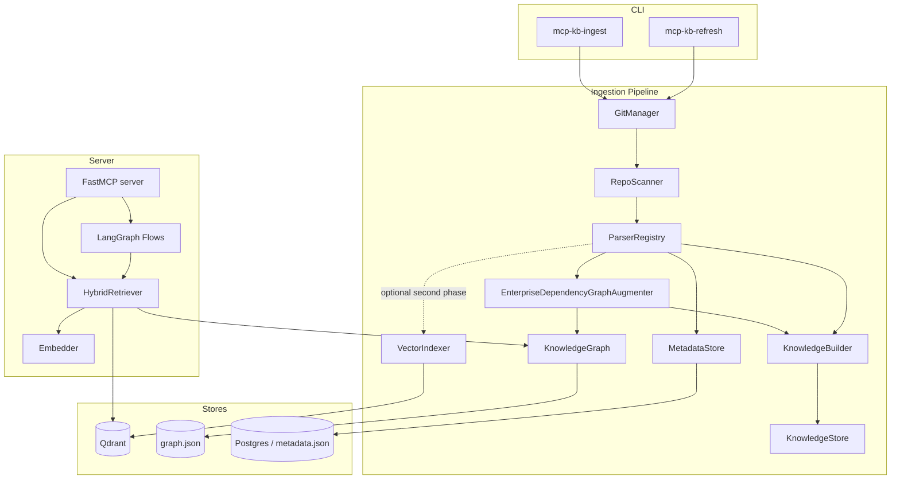
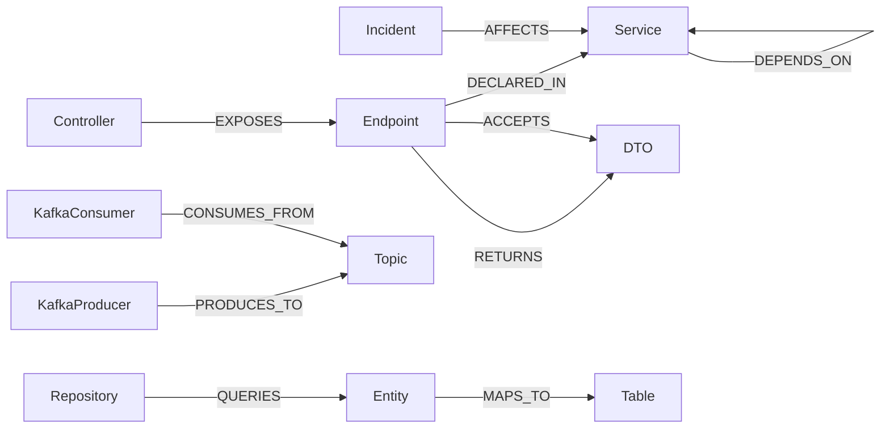

# Architecture

## 1. Goals & constraints

- Centralized knowledge engine for **19 Spring Boot microservices**.
- Runs **entirely locally**; no mandatory cloud services.
- **Accuracy over speed** for repos with 100k+ LOC of Java and thousands of APIs.
- Hybrid **RAG + Knowledge Graph** retrieval, structured JSON + Markdown output.
- Automatic ingestion and **incremental refresh** (git pull → re-index changes).

## 2. Component overview

## 3. Ingestion pipeline

1. **GitManager** clones/pulls each repo and computes a per-file diff
   (`added` / `modified` / `deleted`) between the last indexed commit and HEAD.
2. **RepoScanner** walks the tree, classifies files by content type using globs
   from `config/config.yaml`, and computes a SHA-256 per file.
3. **ParserRegistry** dispatches each file to a specialized parser producing a
   `ParseResult` (graph nodes + edges + retrievable chunks):
   - **JavaParser** (tree-sitter): controllers, endpoints (HTTP method + path from
     `@RequestMapping`/`@GetMapping`/…), entities (+ `@Table`), repositories
     (+ managed entity from `JpaRepository<E, ID>`), DTOs, Feign clients
     (service→service `CALLS`), Kafka `@KafkaListener` consumers and
     `kafkaTemplate.send("topic")` producers.
   - **PomParser**: service identity + intra-ecosystem `DEPENDS_ON` edges.
   - **SpringYamlParser**: config nodes, datasource, Kafka topics.
   - **LiquibaseParser / FlywayParser**: `Table` nodes + columns.
   - **OpenApiParser**: endpoints & schemas from published contracts.
   - **MarkdownParser**: heading-aware doc chunks; incident docs become
     `Incident` nodes with affected services + severity.
4. **EnterpriseDependencyGraphAugmenter** normalizes enterprise dependencies:
  - service-to-service calls from Feign + HTTP client inference
  - REST/API edges and endpoint ownership
  - Kafka producer/consumer edges (`PUBLISHES`, `CONSUMES`)
  - shared library dependency edges (`USES`, `DEPENDS_ON`)
  - database dependency edges (`USES`, `READS`, `WRITES`)
  - queue dependency edges (`PUBLISHES`, `CONSUMES`)
  - gateway node/edges for API gateway repositories
5. **KnowledgeBuilder** transforms parser outputs into typed Pydantic knowledge
  objects and persists them to `data/knowledge/objects.jsonl`.
6. **KnowledgeGraph** merges nodes/edges into a NetworkX multigraph, persisted to a
   JSON snapshot for fast server startup.
7. **VectorIndexer** is optional and runs after knowledge extraction to generate
  embeddings for chunk retrieval.
8. **MetadataStore** records file hashes + last commit for change detection.

### Enterprise dependency graph schema

Primary node types:

- Gateway
- Service
- Endpoint
- Kafka Topic
- Queue
- Database

Primary relationship types:

- CALLS
- PUBLISHES
- CONSUMES
- USES
- READS
- WRITES
- DEPENDS_ON

This graph is generated automatically on every ingestion run.

### Business capability discovery

The indexer also builds a capability graph that maps business capabilities to
technical implementations.

Capability entities:

- BusinessCapability

Capability mappings:

- BusinessCapability -> Services
- BusinessCapability -> APIs
- BusinessCapability -> Databases
- BusinessCapability -> Events

Stored per capability:

- summary
- mapped services
- mapped APIs
- mapped databases
- mapped events
- execution-flow summaries

The `explain_business_capability(query)` tool answers questions such as:

- How checkout works?
- Where payment validation occurs?
- Which services participate in inventory reservation?

## Incident intelligence

The server includes an incident-intelligence subsystem for production exception
analysis and historical memory.

Stored artifacts:

- Exceptions
- Stack traces
- Logs
- RCA documents
- Resolutions

Extracted fields:

- Exception type
- Class
- Method
- Service
- Version
- Environment

Persisted incident model includes:

- Incident
- Root cause
- Fix
- Severity
- Affected services

Incident linkage graph:

- Incident -> Method
- Incident -> Class
- Incident -> Service
- Incident -> Endpoint

When a new exception arrives, pipeline steps are:

1. Parse stack trace and logs.
2. Resolve code areas and affected services from graph.
3. Search similar historical incidents.
4. Generate probable root cause and suggested fix.
5. Persist incident record and graph links.

Similarity search uses incident vectors (Qdrant) with a local keyword fallback.

## LangGraph agent orchestration

The retrieval pipeline is refactored into specialized agents:

- Code Retrieval Agent
- Dependency Analysis Agent
- Execution Flow Agent
- Incident Analysis Agent
- Version Analysis Agent
- Answer Verification Agent

Workflow stages:

1. Question
2. Intent Detection
3. Agent Selection
4. Graph Retrieval
5. Vector Retrieval
6. Reranking
7. Verification
8. Final Answer

Implementation lives in [src/mcp_kb/agents/multi_stage_workflow.py](src/mcp_kb/agents/multi_stage_workflow.py).

## Semantic summaries

During indexing, semantic summaries are generated for:

- Class
- Method
- API
- Repository

Summary schema includes:

- Purpose
- Responsibilities
- Dependencies
- Failure Modes
- Business Meaning
- Consumers
- Producers

Implementation:

- [src/mcp_kb/semantic/summaries.py](src/mcp_kb/semantic/summaries.py)

Storage model:

- Summaries are indexed as semantic chunks in the `semantic` vector collection.
- Each summary chunk is stored alongside embeddings and linked to source file path.

Cache strategy:

- File-backed semantic cache keyed by summary id + fingerprint.
- Fingerprint includes node attributes and edge signature.
- Unchanged symbols reuse cached summary text to avoid regeneration cost.

Update strategy:

- Incremental indexing removes changed-file chunks by path across all collections.
- Semantic summary chunks share source rel_path with code chunks, so updates and
  deletions are automatically consistent with existing incremental remove/replace.

Retrieval prioritization:

- Retrieval checks semantic collection before source code collections.
- Fusion score includes a semantic-summary boost so semantic chunks rank ahead of
  raw source chunks when both are relevant.

### Method semantic contract

Each extracted method object stores:

- `purpose`
- `inputs`
- `outputs`
- `callers`
- `callees`
- `exceptions_thrown`
- `exceptions_caught`
- `database_tables_used`
- `apis_called`
- `business_purpose`

### Incremental refresh (goal #8)

`mcp-kb-refresh` performs, per repo: `git pull` → diff → delete stale graph and
knowledge objects for removed files → re-parse only files whose SHA-256 changed →
replace graph and knowledge objects. Embeddings can be generated in a later pass.

## 4. Knowledge graph schema

Node types: `Service, Controller, Endpoint, DTO, Entity, Repository, Table,
KafkaProducer, KafkaConsumer, Topic, Config, Incident`.

Edge types: `EXPOSES, DECLARED_IN, RETURNS, ACCEPTS, MAPS_TO, QUERIES,
PRODUCES_TO, CONSUMES_FROM, CALLS, DEPENDS_ON, AFFECTS`.

Enterprise traversal queries are exposed as MCP tools:

- `service_dependents(service_name)` → "What depends on Service X?"
- `service_failure_impact(service_name)` → "What can be impacted if Service Y fails?"

## 5. Hybrid retrieval (RAG + KG)

1. Embed the query; run vector search across the relevant per-type collections.
2. **Reciprocal Rank Fusion** merges the ranked lists (robust to score scaling).
3. **Graph expansion** seeds nodes from (a) query-name matches and (b) symbols in
   the retrieved code chunks, then pulls one-hop neighbours for structural context.
4. The fused chunks + graph facts feed either a deterministic extractive summary
   (no LLM) or an LLM synthesis step (LangGraph) grounded strictly in context.

Tuning lives in `config.yaml → retrieval` (`vector_top_k`, `graph_expansion_hops`,
`rerank_top_k`, `rrf_k`) and `vector.hnsw` (`m`, `ef_construct`, `ef_search`).

## 6. LangGraph flows

`analyze_defect`, `implement_feature` and `trace_business_flow` run a small,
inspectable state machine: `retrieve → reason(graph) → synthesize`. The `reason`
node is intent-specific (e.g. defect analysis computes the impacted blast radius;
feature planning collects endpoint/entity touchpoints).

## 7. Scaling to large monorepos

- Per-type collections keep vector search sharply scoped and fast even with millions
  of chunks.
- Class- and method-level chunking bounds embedding size while preserving locality.
- Payload indexes on `service`, `content_type`, `kind`, `repo` enable filtered
  search (e.g. only a service's endpoints).
- Graph is held in memory for O(hops) traversal; the JSON snapshot avoids re-ingest
  on startup. For very large graphs, mirror to Postgres (`graph_nodes/edges`).
- Ingestion is per-file and idempotent, so it parallelizes across repos.

## 8. Codebase-memory-mcp parity roadmap

This section documents the CBM-parity work: bringing the best capabilities of
`codebase-memory-mcp` (a generic, multi-language, single-binary code
intelligence MCP server) into this platform while keeping the enterprise
Spring Boot/microservices depth that CBM doesn't have. Delivered in 7 phases
plus follow-on hardening; every item below is implemented and tested, not
aspirational.

### 8.1 Agent-facing platform tools (Phase 1)

- **Tool profiles**: `MCP_KB_TOOL_PROFILE=ALL|ANALYSIS|SCOUT` restricts which
  tools a session sees, layered on top of RBAC — see
  `security/tool_profiles.py` and `security/enforcement.py`.
- **`query_graph`**: ad-hoc read-only Cypher passthrough
  (`graph/neo4j_store.py::run_cypher`), rejects any write clause
  (`CREATE`/`MERGE`/`DELETE`/`SET`/`DROP`/`LOAD CSV`/...).
- **`check_index_coverage`**, **`get_file_outline`**, **`find_dead_code`**,
  **`compare_graphs`**, **`manage_adr`** — see `tools/knowledge_service/_platform.py`.
- **`.mcpkbignore`**: gitignore-style exclude file layered under
  `config/repos.yaml`'s glob include list (`ingestion/repo_scanner.py`).

### 8.2 Graph model enrichment (Phase 2)

- **`SIMILAR_TO`** edges: pure-Python MinHash (K=32) + banded LSH over
  AST-derived method-body identifier shingles
  (`ingestion/enrichment/similarity.py`). Uses `hashlib.blake2b` (not
  Python's built-in `hash()`, which is `PYTHONHASHSEED`-salted and would
  make signatures non-reproducible across runs).
- **`SEMANTICALLY_RELATED`** edges (opt-in, `SEMANTIC_BRIDGE_ENABLED`):
  embedding-cosine vocabulary-mismatch bridge, bounded per-service
  (`ingestion/enrichment/semantic_bridge.py`).
- **`FILE_CHANGES_WITH`** edges: git co-change coupling analysis
  (min-commits + coupling-score thresholds, refactor-noise filter) —
  `ingestion/enrichment/git_coupling.py`.
- **Infra-as-code nodes**: Dockerfile (real instruction tokenizer, handles
  multi-stage builds and line continuations) and Kubernetes/Kustomize YAML
  (structural traversal of every pod-spec-bearing workload kind) —
  `ingestion/parsers/infra_parser.py`.
- **Service-pattern edges**: gRPC (`GRPC_CALLS`), GraphQL
  (`GRAPHQL_RESOLVES`), generic pub-sub (`EMITS`/`LISTENS_ON` for RabbitMQ
  and Spring `ApplicationEventPublisher`) — all AST-based (tree-sitter node
  walks), not regex-over-source-text, in `ingestion/parsers/java_parser.py`.

### 8.3 Continuous/incremental indexing (Phase 3)

- **`ingestion/watcher.py`**: background thread, `git pull` + incremental
  re-index of every known repo (`WATCHER_ENABLED`,
  `WATCHER_INTERVAL_MINUTES`), plus auto-index of never-ingested repos
  found under `MCP_KB_REPOS_ROOT` (`AUTO_INDEX_ENABLED`/`AUTO_INDEX_LIMIT`).
- **Single-instance coordination** (`ingestion/single_instance.py`):
  cross-platform PID-file advisory lock (Windows `OpenProcess`, POSIX
  `os.kill(pid,0)`, stale-lock auto-reclaim) so multiple MCP server
  processes on one machine (one per connected agent client) don't each spin
  up a duplicate watcher/UI thread.
- **`export_snapshot`/`import_snapshot`**: portable gzip+JSON graph snapshot
  (`graph/snapshot.py`) — share a pre-built index instead of everyone
  re-running full ingestion. Path-traversal-safe (`security/path_safety.py`).

### 8.4 Generic multi-language extraction engine (Phase 4)

`ingestion/langspec.py` (`LangSpec` table) + `ingestion/parsers/
generic_extractor.py` (`GenericTreeSitterParser`): one generic tree-sitter
walker driven entirely by a per-language spec table, instead of a
hand-written visitor per language — adding a language is one table entry,
not new traversal code. Every language maps to the **same** graph schema
(`File`/`Class`/`Interface`/`Method`/`Parameter` + `DECLARED_IN`/`CALLS`/
`DATA_FLOWS`/`HAS_PARAMETER`), so every existing tool (`impact_analysis`,
`call_graph`, `find_callers`) works unchanged regardless of source language.

Languages wired (12 total): **Java** (dedicated deep Spring Boot parser,
unchanged) + **Python, Go, TypeScript, TSX, JavaScript, C#, Rust, Ruby, PHP,
C, C++, Bash** via the generic engine. Dependency: `tree-sitter-language-pack`
(371 grammars available — verified field names per grammar via probe
scripts, never guessed).

**`DATA_FLOWS` edges**: `Parameter` nodes + `HAS_PARAMETER` edges per method;
argument-to-parameter passthrough binding (caller's own parameter, passed as
a bare identifier to a callee, positionally bound to the callee's declared
parameter) — precision-first, no local-variable dataflow. Correctly offsets
for instance-method call sites that don't pass `self`/`this` explicitly even
when it's a declared parameter (Python/Rust convention).

**Deferred, not guessed**: Kotlin/Swift/Scala/Lua — their tree-sitter
grammars (via tree-sitter-language-pack) don't expose named fields on
class/function/call nodes (`child_by_field_name` always returns `None`);
supporting them needs a second, positional-child extraction code path, a
real architecture addition rather than a `LangSpec` table tweak.

### 8.5 Performance benchmarking + CI regression gate (Phase 5)

- **`eval/performance.py`**: `benchmark_parse_throughput` (infra-independent
  — `RepoScanner`+`ParserRegistry` only, no Neo4j/Qdrant — the gated metric)
  and `benchmark_query_latency` (p50/p95 for live tool calls, informational).
- **`eval/token_efficiency.py`**: deterministic proxy (~4 chars/token
  heuristic, no LLM dependency/flakiness) comparing raw-file-dump size vs.
  structured-tool-output size for the same question.
- **`eval/cli_perf.py`** (`mcp-kb-eval-perf`): always runs the parse
  benchmark, fails the build on >15% regression vs. the last recorded run
  (`PERF_REGRESSION_THRESHOLD`, matching CBM's own release-blocker policy).
- CI: `.github/workflows/benchmark.yml`.

### 8.6 Security hardening (Phase 6)

Real vulnerabilities found via `bandit` and fixed (not just gated):
- SHA1 hashing without `usedforsecurity=False` (non-cryptographic id/cache
  keys, flagged unnecessarily) — fixed.
- `httpx verify=False` disabling TLS certificate validation entirely in
  `integrations/rally_client.py` — fixed to secure-by-default with an
  explicit, documented opt-out (`RALLY_VERIFY_SSL=false`).
- **XXE hardening**: this platform parses XML (`pom.xml`, `.csproj`,
  Liquibase changelogs) from arbitrarily-cloned, untrusted git repos.
  `security/safe_xml.py` (lxml with `resolve_entities=False`,
  `no_network=True`, no DTD loading) is used at all 5 `lxml.etree.parse`
  call sites; `tech_detector.py`'s stdlib XML parsing uses `defusedxml`.
- **Path traversal fix**: `manage_adr`/`export_snapshot`/`import_snapshot`
  built file paths directly from agent-supplied names with no sanitization.
  `security/path_safety.py::safe_join` (ASCII allowlist + resolved-path
  containment check) is now used by all three.
- `scripts/security_audit.py` (bandit wrapper, gates on HIGH severity only)
  + `tests/unit/test_security_adversarial.py` (path-traversal payloads,
  hypothesis property tests proving `safe_join` never escapes its base
  directory across 300 generated inputs, Cypher write-injection rejection).
- CI: `.github/workflows/security.yml`.

### 8.7 Local graph visualization UI + zero-dependency graph mode (Phase 7)

- **`ui/graph_viewer.py`**: Starlette app (`/`, `/api/services`,
  `/api/graph`), 2D force-directed graph via vis-network (CDN-loaded, no
  bundled JS asset). Auto-starts on `GRAPH_UI_ENABLED=true`; standalone via
  `mcp-kb-ui`. Guarded by the same single-instance lock as the watcher.
- **`GRAPH_BACKEND=networkx`**: promoted from "legacy migration only" to an
  officially-supported, zero-infrastructure local graph mode (JSON-file
  persisted, no database to run). Honest limitation: `HybridRetriever`
  still requires Qdrant for semantic search even in this mode — a full
  local vector-store fallback would need a `VectorStorePort` abstraction,
  not yet built.

### 8.8 Qdrant performance (follow-on)

`vector/qdrant_store.py` rewritten for high-throughput bulk ingestion:
`upsert()` now uses `client.upload_points()` (qdrant-client's own batched +
parallelized bulk-ingest primitive — `QDRANT_UPSERT_BATCH_SIZE`/
`QDRANT_UPSERT_PARALLEL`, async-ack by default via `QDRANT_UPSERT_WAIT=false`)
instead of one blocking `client.upsert()` call per collection. A
`_known_existing` cache removes a network round-trip `collection_exists()`
check from the hot path on every `upsert()`/`search()` call. New
`delete_by_ids()` gives O(1) point-id deletes for surgical single-chunk
updates (vs. the existing filter-scan `delete_by_paths`, kept for bulk-file
deletes). Optional gRPC transport (`QDRANT_PREFER_GRPC`) and on-disk-vectors
(`QDRANT_ON_DISK_VECTORS`) for indexes too large for RAM.

### 8.9 Deep Spring Boot domain modeling (follow-on)

`ingestion/parsers/java_parser.py` additions, all AST-based:
- **`@Configuration`/`@Bean`** → `BeanDefinition` nodes (name, produced
  type, active `@Profile`, `@ConditionalOnProperty` gating) + `GENERATES`
  edges from the config class — answers "what provides bean X".
- **`@ExceptionHandler`** (in `@RestController` and `@ControllerAdvice`/
  `@RestControllerAdvice`) → `CATCHES` edges to the handled exception
  type(s), tagged `global_handler` true/false, `@ResponseStatus` captured —
  answers "how is exception X handled". Handles both single-exception and
  array-form (`{A.class, B.class}`) handler declarations.
- **`@Scheduled`/`@Async`/`@Retryable`** → structured `scheduling` metadata
  on `Method` nodes (cron/fixedDelay/fixedRate/initialDelay, async
  executor, retry maxAttempts/backoff) instead of a bare annotation name.

Two grammar-shape bugs were found and fixed while building this (verified
via direct AST dumps, not assumed): `X.class` literals are tree-sitter-java
node type `class_literal` (not `field_access`), and array-form annotation
arguments (`{A.class, B.class}`) are node type
`element_value_array_initializer` (not `array_initializer`) — the fix
improves *all* array-form annotation parsing project-wide, not just the new
Spring features.

