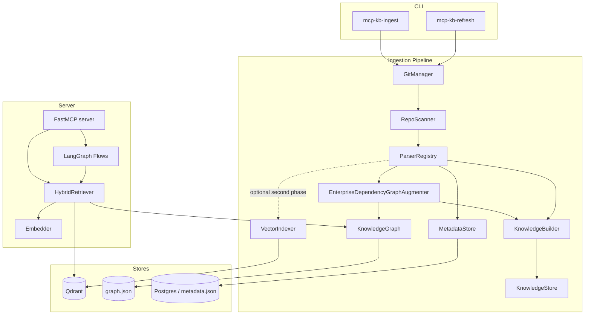
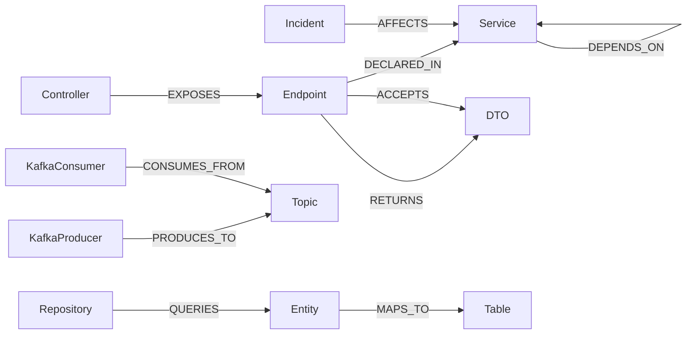

# Architecture

## 1. Goals & constraints

- Centralized knowledge engine for **19 Spring Boot microservices**.
- Runs **entirely locally**; no mandatory cloud services.
- **Accuracy over speed** for repos with 100k+ LOC of Java and thousands of APIs.
- Hybrid **RAG + Knowledge Graph** retrieval, structured JSON + Markdown output.
- Automatic ingestion and **incremental refresh** (git pull → re-index changes).

## 2. Component overview

## 3. Ingestion pipeline

1. **GitManager** clones/pulls each repo and computes a per-file diff
   (`added` / `modified` / `deleted`) between the last indexed commit and HEAD.
2. **RepoScanner** walks the tree, classifies files by content type using globs
   from `config/config.yaml`, and computes a SHA-256 per file.
3. **ParserRegistry** dispatches each file to a specialized parser producing a
   `ParseResult` (graph nodes + edges + retrievable chunks):
   - **JavaParser** (tree-sitter): controllers, endpoints (HTTP method + path from
     `@RequestMapping`/`@GetMapping`/…), entities (+ `@Table`), repositories
     (+ managed entity from `JpaRepository<E, ID>`), DTOs, Feign clients
     (service→service `CALLS`), Kafka `@KafkaListener` consumers and
     `kafkaTemplate.send("topic")` producers.
   - **PomParser**: service identity + intra-ecosystem `DEPENDS_ON` edges.
   - **SpringYamlParser**: config nodes, datasource, Kafka topics.
   - **LiquibaseParser / FlywayParser**: `Table` nodes + columns.
   - **OpenApiParser**: endpoints & schemas from published contracts.
   - **MarkdownParser**: heading-aware doc chunks; incident docs become
     `Incident` nodes with affected services + severity.
4. **EnterpriseDependencyGraphAugmenter** normalizes enterprise dependencies:
  - service-to-service calls from Feign + HTTP client inference
  - REST/API edges and endpoint ownership
  - Kafka producer/consumer edges (`PUBLISHES`, `CONSUMES`)
  - shared library dependency edges (`USES`, `DEPENDS_ON`)
  - database dependency edges (`USES`, `READS`, `WRITES`)
  - queue dependency edges (`PUBLISHES`, `CONSUMES`)
  - gateway node/edges for API gateway repositories
5. **KnowledgeBuilder** transforms parser outputs into typed Pydantic knowledge
  objects and persists them to `data/knowledge/objects.jsonl`.
6. **KnowledgeGraph** merges nodes/edges into a NetworkX multigraph, persisted to a
   JSON snapshot for fast server startup.
7. **VectorIndexer** is optional and runs after knowledge extraction to generate
  embeddings for chunk retrieval.
8. **MetadataStore** records file hashes + last commit for change detection.

### Enterprise dependency graph schema

Primary node types:

- Gateway
- Service
- Endpoint
- Kafka Topic
- Queue
- Database

Primary relationship types:

- CALLS
- PUBLISHES
- CONSUMES
- USES
- READS
- WRITES
- DEPENDS_ON

This graph is generated automatically on every ingestion run.

### Business capability discovery

The indexer also builds a capability graph that maps business capabilities to
technical implementations.

Capability entities:

- BusinessCapability

Capability mappings:

- BusinessCapability -> Services
- BusinessCapability -> APIs
- BusinessCapability -> Databases
- BusinessCapability -> Events

Stored per capability:

- summary
- mapped services
- mapped APIs
- mapped databases
- mapped events
- execution-flow summaries

The `explain_business_capability(query)` tool answers questions such as:

- How checkout works?
- Where payment validation occurs?
- Which services participate in inventory reservation?

## Incident intelligence

The server includes an incident-intelligence subsystem for production exception
analysis and historical memory.

Stored artifacts:

- Exceptions
- Stack traces
- Logs
- RCA documents
- Resolutions

Extracted fields:

- Exception type
- Class
- Method
- Service
- Version
- Environment

Persisted incident model includes:

- Incident
- Root cause
- Fix
- Severity
- Affected services

Incident linkage graph:

- Incident -> Method
- Incident -> Class
- Incident -> Service
- Incident -> Endpoint

When a new exception arrives, pipeline steps are:

1. Parse stack trace and logs.
2. Resolve code areas and affected services from graph.
3. Search similar historical incidents.
4. Generate probable root cause and suggested fix.
5. Persist incident record and graph links.

Similarity search uses incident vectors (Qdrant) with a local keyword fallback.

## LangGraph agent orchestration

The retrieval pipeline is refactored into specialized agents:

- Code Retrieval Agent
- Dependency Analysis Agent
- Execution Flow Agent
- Incident Analysis Agent
- Version Analysis Agent
- Answer Verification Agent

Workflow stages:

1. Question
2. Intent Detection
3. Agent Selection
4. Graph Retrieval
5. Vector Retrieval
6. Reranking
7. Verification
8. Final Answer

Implementation lives in [src/mcp_kb/agents/multi_stage_workflow.py](src/mcp_kb/agents/multi_stage_workflow.py).

## Semantic summaries

During indexing, semantic summaries are generated for:

- Class
- Method
- API
- Repository

Summary schema includes:

- Purpose
- Responsibilities
- Dependencies
- Failure Modes
- Business Meaning
- Consumers
- Producers

Implementation:

- [src/mcp_kb/semantic/summaries.py](src/mcp_kb/semantic/summaries.py)

Storage model:

- Summaries are indexed as semantic chunks in the `semantic` vector collection.
- Each summary chunk is stored alongside embeddings and linked to source file path.

Cache strategy:

- File-backed semantic cache keyed by summary id + fingerprint.
- Fingerprint includes node attributes and edge signature.
- Unchanged symbols reuse cached summary text to avoid regeneration cost.

Update strategy:

- Incremental indexing removes changed-file chunks by path across all collections.
- Semantic summary chunks share source rel_path with code chunks, so updates and
  deletions are automatically consistent with existing incremental remove/replace.

Retrieval prioritization:

- Retrieval checks semantic collection before source code collections.
- Fusion score includes a semantic-summary boost so semantic chunks rank ahead of
  raw source chunks when both are relevant.

### Method semantic contract

Each extracted method object stores:

- `purpose`
- `inputs`
- `outputs`
- `callers`
- `callees`
- `exceptions_thrown`
- `exceptions_caught`
- `database_tables_used`
- `apis_called`
- `business_purpose`

### Incremental refresh (goal #8)

`mcp-kb-refresh` performs, per repo: `git pull` → diff → delete stale graph and
knowledge objects for removed files → re-parse only files whose SHA-256 changed →
replace graph and knowledge objects. Embeddings can be generated in a later pass.

## 4. Knowledge graph schema

Node types: `Service, Controller, Endpoint, DTO, Entity, Repository, Table,
KafkaProducer, KafkaConsumer, Topic, Config, Incident`.

Edge types: `EXPOSES, DECLARED_IN, RETURNS, ACCEPTS, MAPS_TO, QUERIES,
PRODUCES_TO, CONSUMES_FROM, CALLS, DEPENDS_ON, AFFECTS`.

Enterprise traversal queries are exposed as MCP tools:

- `service_dependents(service_name)` → "What depends on Service X?"
- `service_failure_impact(service_name)` → "What can be impacted if Service Y fails?"

## 5. Hybrid retrieval (RAG + KG)

1. Embed the query; run vector search across the relevant per-type collections.
2. **Reciprocal Rank Fusion** merges the ranked lists (robust to score scaling).
3. **Graph expansion** seeds nodes from (a) query-name matches and (b) symbols in
   the retrieved code chunks, then pulls one-hop neighbours for structural context.
4. The fused chunks + graph facts feed either a deterministic extractive summary
   (no LLM) or an LLM synthesis step (LangGraph) grounded strictly in context.

Tuning lives in `config.yaml → retrieval` (`vector_top_k`, `graph_expansion_hops`,
`rerank_top_k`, `rrf_k`) and `vector.hnsw` (`m`, `ef_construct`, `ef_search`).

## 6. LangGraph flows

`analyze_defect`, `implement_feature` and `trace_business_flow` run a small,
inspectable state machine: `retrieve → reason(graph) → synthesize`. The `reason`
node is intent-specific (e.g. defect analysis computes the impacted blast radius;
feature planning collects endpoint/entity touchpoints).

## 7. Scaling to large monorepos

- Per-type collections keep vector search sharply scoped and fast even with millions
  of chunks.
- Class- and method-level chunking bounds embedding size while preserving locality.
- Payload indexes on `service`, `content_type`, `kind`, `repo` enable filtered
  search (e.g. only a service's endpoints).
- Graph is held in memory for O(hops) traversal; the JSON snapshot avoids re-ingest
  on startup. For very large graphs, mirror to Postgres (`graph_nodes/edges`).
- Ingestion is per-file and idempotent, so it parallelizes across repos.
