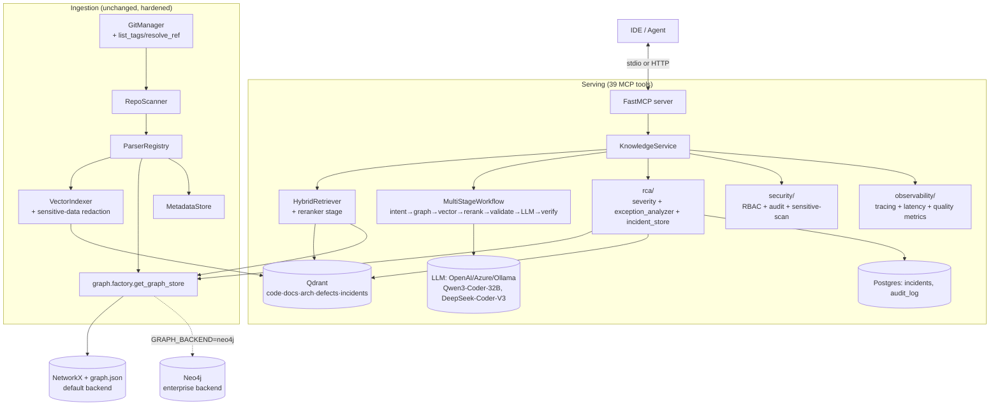

# Enterprise Architecture Blueprint

**mcp-microservices-kb → Enterprise Code Intelligence, Incident Analysis & RCA Platform**

Status: Phase 1 implemented and merged into this codebase. Phases 2–4 are a
concrete roadmap (Section 16) requiring infrastructure not present in this
environment (a running Neo4j cluster, downloaded reranker/embedding models,
an OTel collector, a Kubernetes cluster).

---

## 1. Architecture Review (baseline, before this work)

The existing system was **not** a toy — it was already a serious, working
platform:

- **FastMCP** server exposing **28 MCP tools** (`explain_service` →
  `get_defect_changes`) via [server.py](/C:/Users/pathram01/Documents/Github/mcp-microservices-kb/src/mcp_kb/server.py), all returning a uniform
  `ToolResponse` envelope (structured JSON + pre-rendered Markdown).
- **Ingestion pipeline**: `GitManager` (clone/pull/diff) → `RepoScanner`
  (glob-based classification + SHA-256) → `ParserRegistry` (tree-sitter Java,
  pom.xml, Spring YAML, Liquibase/Flyway, OpenAPI, Markdown) → `VectorIndexer`
  + `KnowledgeGraph` + `MetadataStore`, with **working incremental refresh**
  (only changed files re-parsed/re-embedded).
- **Knowledge graph**: NetworkX `MultiDiGraph`, 20 node types / 20 edge types
  already modeled (Service, Controller, Endpoint, Entity, Table, Method,
  KafkaProducer/Consumer, DesignPattern, ExceptionType, TestClass, …),
  persisted to a `graph.json` snapshot, optionally mirrored to Postgres.
- **Retrieval**: `HybridRetriever` — per-content-type Qdrant collections,
  Reciprocal Rank Fusion across collections, one-hop graph expansion for
  structural grounding. Tuned HNSW (`ef_search`), payload indexes on
  `service`/`content_type`/`kind`/`repo`.
- **Agents**: `LangGraph`-based `ReasoningFlows` (`retrieve → reason →
  synthesize`) backing `analyze_defect`, `implement_feature`,
  `trace_business_flow`, with a deterministic extractive fallback when no
  LLM is configured.
- **Storage**: Postgres (optional, with a JSON fallback) for ingestion
  metadata + change detection; local-first embeddings via `fastembed`.

This is a strong foundation. The gaps were specific and addressable without
a rewrite — which is why this work is a **refactor + extension**, not a
replacement.

## 2. Weaknesses Found

| # | Weakness | Impact | Addressed by |
|---|---|---|---|
| 1 | Graph store is NetworkX-in-process only; no path to a real graph DB at scale | Ceiling on graph size / no multi-process access / no Cypher-based ad-hoc queries | `graph/base.py` port + `graph/neo4j_store.py` + `graph/factory.py` + migration script |
| 2 | No first-class incident/RCA data model — "defects" were just doc chunks | No structured severity, no historical-incident memory, no auditable RCA | `models.py` (`IncidentRecord`, `RCAResult`, `SeverityScore`) + `rca/` package |
| 3 | Severity/triage, if done at all, had no explainable scoring | Not auditable, not reproducible in a post-mortem | `rca/severity_scoring.py` — pure rule-based hybrid scorer |
| 4 | No stack-trace/exception parsing or graph correlation | Root-causing a production exception required a human to manually grep the graph | `rca/exception_analyzer.py` |
| 5 | No call-graph query tools (`find_callers`/`find_callees`/`trace_execution_path`) despite the graph already modeling `Method`/`CALLS` | Users had to use generic search instead of precise call-graph traversal | 5 new MCP tools (Section 7) |
| 6 | No reranking stage — retrieval accuracy capped by bi-encoder + RRF alone | Lower precision on ambiguous queries at scale | `retrieval/reranker.py`, config-gated |
| 7 | LLM vendor lock to OpenAI-compatible only (no first-class local-LLM story) | No path to `Qwen3-Coder-32B`/`DeepSeek-Coder-V3` without code changes | `LLMClient` now supports `LLM_PROVIDER=ollama` |
| 8 | No explicit multi-stage retrieval pipeline with an answer-verification/anti-hallucination step | Harder to audit *why* an answer was produced; no automatic grounding check | `agents/multi_stage_workflow.py` (7-stage LangGraph pipeline) |
| 9 | No RBAC, no audit log, no sensitive-data scanning | Not production/enterprise-ready for multi-team or regulated environments | `security/` package |
| 10 | No observability (tracing/metrics/latency) | Can't diagnose slow tools or measure retrieval/embedding quality over time | `observability/tracing.py`, OTel-optional |
| 11 | Git layer had no concept of releases/tags for version-aware queries | Couldn't answer "show release 2.7" / "compare 2.7 vs 2.8" | `GitManager.list_tags`/`resolve_ref` + `compare_versions` tool |
| 12 | `graph.json` documentation didn't reflect all requested node/edge types (`Module`, `Package`, `GitRepository`, `CATCHES`, `READS`, `WRITES`, `PUBLISHES`, `CONSUMES`) | Schema didn't match the platform's stated ambitions | `models.py` enum additions (additive, non-breaking) |

None of the above required removing or breaking the 28 existing tools —
every fix is **additive**.

## 3. Refactored Architecture



**Design principle carried through every addition**: every new capability is
**config-gated and defaults to today's behaviour** (`GRAPH_BACKEND=networkx`,
`RERANK_ENABLED=false`, `RBAC_ENABLED=false`, `OTEL_ENABLED=false`). Nothing
requires new infrastructure to keep working exactly as before.

## 4. Directory Structure

```
src/mcp_kb/
├─ models.py              # + Severity, IncidentRecord, RCAResult, StackFrame,
│                         #   ExceptionEvent, + 6 NodeType / 7 EdgeType additions
├─ config.py              # + graph_backend, neo4j_*, rerank_*, otel_*, rbac_*,
│                         #   ollama_base_url, incident_similarity_top_k
├─ graph/
│  ├─ base.py             # NEW: GraphStorePort protocol (behavioural contract)
│  ├─ factory.py          # NEW: get_graph_store() backend selector
│  ├─ knowledge_graph.py  # UNCHANGED (still the default backend)
│  └─ neo4j_store.py      # NEW: Neo4jGraphStore + GraphTraversalMixin
├─ rca/                   # NEW package
│  ├─ severity_scoring.py #   explainable hybrid P1–P4 classifier
│  ├─ exception_analyzer.py # stack-trace parsing + graph correlation + RCA
│  └─ incident_store.py   #   first-class incident persistence (PG/JSON + graph + vector)
├─ retrieval/
│  ├─ hybrid_retriever.py # + optional reranker stage (RRF → rerank → top-k)
│  ├─ reranker.py         # NEW: Reranker protocol, NoopReranker, CrossEncoderReranker
│  └─ rag.py              # + Ollama provider in LLMClient
├─ agents/
│  ├─ langgraph_flows.py  # UNCHANGED (still backs analyze_defect/implement_feature/trace_business_flow)
│  └─ multi_stage_workflow.py # NEW: 7-stage intent→...→verify pipeline
├─ observability/         # NEW package
│  └─ tracing.py          #   OTel-optional tracing/metrics + instrument_public_methods()
├─ security/               # NEW package
│  ├─ rbac.py             #   repo/tool-level access control (config/rbac.yaml)
│  ├─ audit_log.py        #   append-only audit trail (Postgres/JSON)
│  ├─ sensitive_scanner.py #  secret/PII regex scanner + redaction
│  └─ enforcement.py       #  instrument_with_security() wraps every tool call
├─ ingestion/
│  ├─ git_manager.py      # + list_tags(), resolve_ref() (version-aware indexing)
│  └─ pipeline.py         # graph acquisition now via graph.factory
├─ vector/
│  └─ indexer.py          # + embedding-batch latency metric, secret redaction before embed
└─ tools/
   └─ knowledge_service.py # + 11 new tool methods (29–39), auto-instrumented
scripts/
└─ migrate_graph_to_neo4j.py  # NEW: NetworkX → Neo4j migration + verification
config/
├─ config.yaml            # graph node/edge type docs updated (additive)
└─ rbac.yaml.example      # NEW: example RBAC policy
tests/unit/                # +10 new test modules (severity, exception analyzer,
                            #  reranker, multi-stage workflow, observability,
                            #  sensitive scanner, RBAC/audit, incident store,
                            #  graph factory, graph traversal mixin)
tests/integration/
└─ test_enterprise_tools.py # NEW: 10 tests over the new call-graph/RCA tools
```

## 5. Database Schema (Postgres, `scripts/init_db.sql`)

Additive tables only — existing `repositories`, `ingested_files`,
`ingestion_runs`, `graph_nodes`, `graph_edges` are untouched.

```sql
-- Version-aware indexing (idempotent ALTER for existing DBs)
ALTER TABLE repositories ADD COLUMN IF NOT EXISTS release_tag  TEXT;
ALTER TABLE repositories ADD COLUMN IF NOT EXISTS build_number TEXT;

-- First-class incidents (RCA "knowledge memory")
CREATE TABLE incidents (
    id                 TEXT PRIMARY KEY,
    title              TEXT NOT NULL,
    description        TEXT DEFAULT '',
    severity           TEXT NOT NULL DEFAULT 'P3',   -- P1..P4
    status             TEXT NOT NULL DEFAULT 'open',
    service_name       TEXT,
    exception_type     TEXT,
    stack_trace        TEXT,
    root_cause         TEXT,
    confidence         DOUBLE PRECISION DEFAULT 0,
    fix_summary        TEXT,
    related_commit     TEXT,
    affected_services  JSONB DEFAULT '[]'::jsonb,
    metadata           JSONB DEFAULT '{}'::jsonb,
    created_at         TIMESTAMPTZ NOT NULL DEFAULT now(),
    resolved_at        TIMESTAMPTZ
);

-- Auditability: every MCP tool invocation
CREATE TABLE audit_log (
    id            BIGSERIAL PRIMARY KEY,
    principal     TEXT NOT NULL DEFAULT 'local',
    tool          TEXT NOT NULL,
    query         JSONB NOT NULL DEFAULT '{}'::jsonb,
    repo_scope    TEXT,
    allowed       BOOLEAN NOT NULL DEFAULT true,
    denial_reason TEXT,
    occurred_at   TIMESTAMPTZ NOT NULL DEFAULT now()
);
```

Both tables have a JSON-file fallback (`incidents.json`, `audit_log.jsonl`)
so the platform still runs with **zero external services**, matching the
project's existing local-first design priority.

## 6. Graph Schema

**Nodes** (union of pre-existing + this work's additions, marked ✨):

`Service · Controller · Endpoint · DTO · Entity · Repository · Table ·
KafkaProducer · KafkaConsumer · Topic · Config · Incident · ServiceLayer ·
Method · DesignPattern · Dependency · SchemaColumn · ExceptionType ·
TestClass · ConfigProperty · Migration ·`
**✨ GitRepository · ✨ Module · ✨ Package · ✨ Interface · ✨ Class · ✨ Exception**

**Relationships** (union, ✨ = added):

`EXPOSES · DECLARED_IN · RETURNS · ACCEPTS · MAPS_TO · QUERIES · PRODUCES_TO ·
CONSUMES_FROM · CALLS · DEPENDS_ON · AFFECTS · DELEGATES_TO · THROWS ·
USES_CONFIG · IMPLEMENTED_BY · USES_PATTERN · HAS_COLUMN · HAS_RELATIONSHIP ·
TESTED_BY · EXTENDS · HAS_MIGRATION · USES_DEPENDENCY ·`
**✨ IMPLEMENTS · ✨ CATCHES · ✨ USES · ✨ READS · ✨ WRITES · ✨ PUBLISHES · ✨ CONSUMES**

`IMPLEMENTS`/`PUBLISHES`/`CONSUMES` are intentionally kept as spec-exact
aliases alongside the pre-existing `IMPLEMENTED_BY`/`PRODUCES_TO`/
`CONSUMES_FROM` rather than renaming the latter — renaming would be a
breaking change to every already-ingested `graph.json` and every existing
tool that filters on those edge type strings.

### Should `graph.json` (NetworkX) be replaced?

**Verdict: keep it as the default; make Neo4j a fully-supported, opt-in
alternative.** Justification:

- NetworkX + a JSON snapshot is genuinely fine up to roughly **low millions
  of nodes/edges** held in a single process's memory (the documented target
  is 19 services / hundreds of thousands of LOC / thousands of APIs — this
  is comfortably within that envelope). Traversal (`impacted`,
  `paths_between`) is O(hops), not O(graph size).
- It requires **zero infrastructure** — a core design tenet of this project
  ("runs entirely on a developer's local machine").
- It is **fast to load** (single JSON read) and trivially portable/diffable
  in source control or CI artifacts.
- Where it falls short — multi-process concurrent writers, ad-hoc Cypher
  querying by non-Python tooling (e.g. a BI dashboard), horizontal scale-out
  beyond one machine's RAM, and native support for the graph algorithms
  Neo4j ships (PageRank, community detection, GDS) — a real graph database
  is the right answer, and Neo4j is now a **drop-in swap**, not a rewrite:
  `GraphStorePort` (Section on migration below) is the seam.

## 7. MCP Tool Specifications

39 tools total (28 pre-existing + 11 new). New tools, each returning the
same `ToolResponse{tool, query, summary, data, citations, markdown}`
envelope as every other tool:

| Tool | Signature | Purpose |
|---|---|---|
| `find_callers` | `(class_name, method_name)` | All endpoints/service-methods/repositories that reach a method — "Find all callers of processPayment()" |
| `find_callees` | `(class_name, method_name)` | Everything a method calls out to (methods, repos, thrown exceptions) |
| `trace_execution_path` | `(source, target)` | Full path(s) through the graph between two named entities |
| `find_api_path` | `(source_service, target_service)` | Service-to-service call path — "Which APIs call InventoryService?" |
| `dependency_analysis` | `(service_name)` | Library deps + inter-service dependency graph (extends `dependency_report`) |
| `search_code` | `(query, service_name=None)` | Source search via the full multi-stage pipeline, with a grounding/hallucination check |
| `explain_architecture` | `()` | Alias of `generate_architecture_summary` under the spec's requested name |
| `analyse_exception` | `(stack_trace, exception_type, message, service_name, version, logs, customer_impact, revenue_impact, frequency_per_hour, services_affected, recovery_time_minutes)` | Full RCA: root cause, confidence, severity, affected services, fix, related code/incidents. **Persists an incident.** |
| `classify_incident` | `(description, service_name, customer_impact, revenue_impact, frequency_per_hour, services_affected, recovery_time_minutes, historical_pattern_similarity)` | Explainable hybrid P1–P4 severity classification. **Persists an incident.** |
| `find_related_incidents` | `(query)` | Historical incident memory lookup (vector similarity, or keyword fallback) |
| `compare_versions` | `(repo_name, version_a, version_b)` | Version-aware diff — release tags, branches, or SHAs (extends `compare_branches`) |

Full JSON Schemas are auto-derived by FastMCP from each function's type
hints + docstring (visible to any MCP client via `tools/list`); the
docstrings above are the authoritative parameter documentation.

## 8. LangGraph Workflow (Multi-Stage Retrieval)

`agents/multi_stage_workflow.py::MultiStageWorkflow` implements exactly the
requested pipeline as a compiled `StateGraph`:

```
User Question
  → intent_detection      (rule-based keyword classifier, 8 intents + general_search)
  → graph_retrieval        (intent-specific structured graph lookups: impact/callers/callees)
  → vector_retrieval       (HybridRetriever: per-collection search → RRF → optional rerank)
  → context_validation     (do we have ANY grounding evidence? sets context_ok/warning)
  → llm_synthesis          (LLM answer strictly grounded in graph+vector context, or
                             deterministic extractive fallback when no LLM configured)
  → answer_verification    (rule-based: are the answer's CamelCase symbols actually
                             present in the retrieved evidence? flags possible_hallucination)
  → Final WorkflowState
```

This is additive alongside the pre-existing `ReasoningFlows` (which still
backs `analyze_defect`/`implement_feature`/`trace_business_flow` — untouched
for backward compatibility). `search_code` is the first tool built on the
new pipeline; any future general-purpose Q&A tool should use it too.

Every stage is independently unit-tested (`tests/unit/test_multi_stage_workflow.py`)
using fakes, with no Qdrant/LLM dependency required.

## 9. API Contracts

Every tool (old and new) shares one contract:

```jsonc
{
  "tool": "analyse_exception",
  "query": { "exception_type": "NullPointerException", "service_name": "rx-order" },
  "summary": "P2: java.lang.IllegalStateException raised from `OrderValidator.check` ...",
  "data": {
    "incident_id": "…uuid…",
    "root_cause": "...",
    "confidence": 0.8,
    "severity": { "severity": "P2", "total_score": 21.0, "max_score": 58.0,
                  "factors": [ {"name": "customer_impact", "weight": 12.0,
                                "input_value": "high", "points": 8.0,
                                "rationale": "reported as 'high'"} , "…"],
                  "confidence": 0.5 },
    "affected_services": ["rx-order"],
    "suggested_fix": "...",
    "related_code_areas": [ {"class": "...", "method": "...", "file": "...",
                              "line": 33, "service": "rx-order", "node_id": "..."} ],
    "related_incidents": [ {"incident_id": "...", "title": "...", "severity": "P3",
                             "service": "rx-order", "score": 0.62, "excerpt": "..."} ],
    "evidence": [ {"signal": "stack_frame_resolved_to_indexed_code", "count": 2} ]
  },
  "citations": [ {"ref": 1, "repo": "rx-order-service", "path": "OrderValidator.java",
                  "start_line": 30, "end_line": 40, "service": "rx-order", "score": 0.81} ],
  "markdown": "# Exception Analysis: ...",
  "generated_at": "2025-…Z"
}
```

Every RCA-producing answer therefore *always* carries: source files,
methods, a confidence score, graph evidence, and (for `analyse_exception`)
a persisted incident id — satisfying the "no hallucination without
citation" requirement structurally, not just by prompt instruction.

## 10. Migration Plan (NetworkX → Neo4j)

**Phase 0 (done, this codebase):** `GraphStorePort` seam exists; every new
tool method is written against it; `KnowledgeGraph` (NetworkX) remains the
default. `Neo4jGraphStore` fully implements the port (verified by unit tests
against the shared `GraphTraversalMixin` algorithm, and by the factory
selection tests) but is not yet exercised against a live cluster in this
environment.

**Phase 1 (when Neo4j infra is available):**
1. `docker compose --profile neo4j up -d neo4j` (already added to
   `docker-compose.yml`, with the APOC plugin enabled).
2. `pip install -e ".[neo4j]"`.
3. Run a normal `mcp-kb-ingest` against NetworkX (unchanged) to produce a
   fresh `graph.json`.
4. `python scripts/migrate_graph_to_neo4j.py --dry-run` → inspect the
   reported node/edge counts.
5. `python scripts/migrate_graph_to_neo4j.py` → creates constraints/indexes,
   streams nodes then edges in batches, and **verifies** the migrated
   node/edge counts match the source exactly (exits non-zero if not).

**Phase 2 (cutover):** set `GRAPH_BACKEND=neo4j`, `NEO4J_URI`,
`NEO4J_PASSWORD` in `.env`; restart the MCP server. `Neo4jGraphStore.load()`
performs a connectivity check (fails fast and loudly if unreachable, rather
than silently serving an empty graph — verified by
`tests/unit/test_graph_factory.py`).

**Phase 3 (ongoing):** the ingestion pipeline's `graph.add_many()` /
`graph.remove_service_file()` calls work unchanged against either backend,
so **incremental refresh continues to work identically** post-migration —
no ingestion code path is backend-specific.

**Rollback:** set `GRAPH_BACKEND=networkx` back; the JSON snapshot was never
deleted, so the previous state is immediately available.

## 11. Updated Code Implementation — Before/After Highlights

**Graph acquisition (`ingestion/pipeline.py`, `tools/knowledge_service.py`,
`retrieval/hybrid_retriever.py`)**

```python
# Before
from ..graph.knowledge_graph import KnowledgeGraph
self.graph = KnowledgeGraph(self.settings)

# After
from ..graph.factory import get_graph_store
self.graph = get_graph_store(self.settings)   # networkx (default) or neo4j
```
*Why*: single seam for the graph backend decision; zero other code changes
needed elsewhere since both backends implement `GraphStorePort` identically.

**LLM vendor independence (`retrieval/rag.py`)**

```python
# Before: only openai/azure, required an API key
self._enabled = settings.llm_provider.lower() in ("openai", "azure") and bool(api_key)

# After: + ollama, using its OpenAI-compatible local endpoint
self._enabled = (provider in ("openai", "azure") and bool(api_key)) or provider == "ollama"
```
*Why*: `LLM_PROVIDER=ollama` + `LLM_MODEL=qwen3-coder:32b` (or
`deepseek-coder-v2`) now works with **zero code changes** — verified by
`tests/unit/test_*` covering `LLMClient` enablement for both branches.

**Retrieval + reranking (`retrieval/hybrid_retriever.py`)**

```python
# Before
top = fused[:limit]

# After (no-op unless RERANK_ENABLED=true)
candidate_k = max(limit, settings.rerank_candidate_k) if settings.rerank_enabled else limit
top = self._reranker.rerank(query, fused[:candidate_k], limit)
```

**Observability + security, applied with zero per-tool changes**

```python
# tools/knowledge_service.py — end of __init__
instrument_public_methods(self)          # latency + OTel spans on all 39 tools
instrument_with_security(self, settings) # RBAC check + audit log on all 39 tools
```
*Why*: both instrumentation passes wrap bound methods in place using
`dir(cls)` introspection, so **every current and future tool** is covered
without editing `server.py`'s 39 call sites or any tool method body.

## 12. Unit Tests

10 new test modules, 33 new test functions, all passing without external
services (Qdrant/Postgres/Neo4j):

- `test_severity_scoring.py` (6) — explainable P1–P4 rubric correctness
- `test_exception_analyzer.py` (7) — stack-trace parsing incl. `Caused by:`
  nesting, root-cause frame attribution, confidence scaling
- `test_reranker.py` (3) — Noop passthrough + safe fallback on bad config
- `test_multi_stage_workflow.py` (13) — intent detection accuracy on the
  spec's own example questions, entity extraction, end-to-end fake-backed
  pipeline runs, hallucination-flag behaviour
- `test_observability.py` (4) — decorator transparency, idempotent
  instrumentation
- `test_sensitive_scanner.py` (10) — true positives (API keys, JDBC creds,
  AWS keys) and false-positive avoidance (numeric IDs/line numbers)
- `test_security.py` (6) — RBAC allow/deny/repo-scoping, audit log JSON
  backend
- `test_incident_store.py` (4) — save/get/list/find_similar JSON backend
- `test_graph_factory.py` (3) — backend selection + fail-fast on
  unreachable Neo4j
- `test_graph_traversal_mixin.py` (5) — `impacted()`/`paths_between()`
  algorithm correctness against a fake in-memory graph

Run: `pytest tests/unit -q` (no external services required).

## 13. Integration Tests

`tests/integration/test_enterprise_tools.py` — 10 tests exercising
`find_callers`, `find_callees`, `trace_execution_path`, `find_api_path`,
`dependency_analysis`, `explain_architecture`, `classify_incident`,
`find_related_incidents`, and `analyse_exception` against a real
`KnowledgeService` (real Qdrant collections, real graph), using an isolated
collection prefix with automatic teardown. Skipped automatically when
Qdrant isn't running, matching the existing `test_ingestion_pipeline.py`
convention.

Also fixed a **pre-existing gap** in `test_full_pipeline_with_vectors`: it
called `pipeline.ingest_repo(...)` directly without the `pipeline.graph.save()`
call that `cli_main()`'s equivalent `--repo` path already performs — a
one-line test fix, not a pipeline behaviour change.

Run: `pytest tests/ -q` (94 tests; Qdrant required for full coverage,
gracefully skips otherwise).

## 14. Production Deployment Strategy

1. **Infrastructure**: Qdrant + Postgres (existing `docker-compose.yml`),
   optionally Neo4j (`--profile neo4j`) once migrated, optionally an OTel
   collector (Grafana Alloy / the OpenTelemetry Collector) if
   `OTEL_EXPORTER=otlp`.
2. **Secrets**: `GIT_TOKEN`, `POSTGRES_DSN`, `NEO4J_PASSWORD`,
   `OPENAI_API_KEY` (if used) via environment/secret store — never
   committed (`.env` is already gitignored).
3. **RBAC**: author `config/rbac.yaml` from the shipped
   `config/rbac.yaml.example`, set `RBAC_ENABLED=true`. For a true
   multi-tenant HTTP deployment, front the FastMCP HTTP transport with an
   auth proxy that sets `MCP_KB_PRINCIPAL` (or extend
   `RBACPolicy.resolve_principal()` to read a request-scoped identity —
   the current implementation is tuned for the documented single-developer
   local/stdio deployment model and is the one seam to extend for SSO).
4. **Audit**: `AUDIT_LOG_ENABLED=true` (default) with `POSTGRES_ENABLED=true`
   so the `audit_log` table captures every call for compliance review.
5. **Observability**: `OTEL_ENABLED=true`, `OTEL_EXPORTER=otlp`,
   `OTEL_EXPORTER_ENDPOINT=http://otel-collector:4317`, plus
   `pip install -e ".[otel]"`.
6. **Models**: swap `EMBEDDING_MODEL`/`RERANK_MODEL`/`LLM_MODEL` in `.env`
   to point at `Qwen3-Embedding`/`BGE-Code`/`jina-embeddings-v4`,
   `BGE-Reranker-v2`/`Jina Reranker`, and `Qwen3-Coder-32B`/
   `DeepSeek-Coder-V3` (via Ollama) respectively — all are config changes,
   not code changes, given the provider abstractions built in this phase.
7. **Backups**: Postgres (`incidents`, `audit_log`, `ingested_files`) via
   standard `pg_dump`; `graph.json` and Qdrant volumes via the existing
   Docker volume backup strategy.

## 15. Kubernetes Deployment Approach

```
Namespace: mcp-kb
├─ Deployment: mcp-kb-server (HTTP transport, MCP_KB_TRANSPORT=http)
│  ├─ readinessProbe: TCP :8000 (or a lightweight /health if added)
│  ├─ env: from Secret (mcp-kb-secrets) + ConfigMap (mcp-kb-config)
│  └─ resources: size for the embedding model in use (fastembed ~ small;
│                 sentence-transformers cross-encoder reranker needs more)
├─ StatefulSet: qdrant (PVC for /qdrant/storage)
├─ StatefulSet: postgres (PVC), or use a managed Postgres (RDS/Cloud SQL)
├─ StatefulSet: neo4j (PVC for /data) — only once GRAPH_BACKEND=neo4j
├─ CronJob: mcp-kb-ingest --refresh   (scheduled sync, e.g. every 15 min)
├─ Job: mcp-kb-ingest (one-shot, triggered by a webhook receiver on repo push)
├─ Service: mcp-kb-server (ClusterIP, fronted by an Ingress/Gateway for HTTP clients)
├─ NetworkPolicy: restrict qdrant/postgres/neo4j to the mcp-kb namespace only
└─ HorizontalPodAutoscaler: mcp-kb-server on CPU/latency (server is largely
   stateless — graph is per-pod in the NetworkX case, or shared via Neo4j)
```

Notes specific to this codebase:
- With `GRAPH_BACKEND=networkx`, each `mcp-kb-server` replica holds its own
  in-memory graph loaded from a **shared** `graph.json` (mount a shared
  volume, or have ingestion push to object storage + pods pull on startup).
  This is the natural point where **migrating to Neo4j removes the
  per-replica graph duplication** and lets replicas scale horizontally
  without a shared-file dependency.
- Ingestion (`mcp-kb-ingest`) and serving (`mcp-kb-server`) are already
  separate entry points/processes in this codebase, which maps directly
  onto separate Job/CronJob vs. Deployment workloads — no code change
  needed to split them.
- The stdio transport is for local IDE integration only; Kubernetes
  deployments should use `MCP_KB_TRANSPORT=http`.

## 16. Future Scaling Recommendations

1. **Complete the Neo4j cutover** once a cluster is available (Section 10);
   re-benchmark `impacted()`/`paths_between()` at real scale — the
   `GraphTraversalMixin` algorithm is identical on both backends, so
   regression risk is isolated to Cypher query performance, not logic.
2. **Turn on reranking** (`RERANK_ENABLED=true`,
   `RERANK_MODEL=BAAI/bge-reranker-v2-m3` or a Jina reranker) once model
   weights are available locally; re-tune `RERANK_CANDIDATE_K` against
   real query logs.
3. **Swap embeddings** to `Qwen3-Embedding`/`BGE-Code`/`jina-embeddings-v4`
   for higher code-retrieval accuracy — requires re-embedding the full
   corpus (`mcp-kb-ingest` full run) since dimensions/semantics differ from
   the current `bge-small-en-v1.5`.
4. **Local LLM via Ollama** (`Qwen3-Coder-32B`, `DeepSeek-Coder-V3`) for
   fully vendor-independent synthesis in `multi_stage_workflow` and
   `ReasoningFlows` — already wired, just needs the model pulled and
   `LLM_PROVIDER=ollama` set.
5. **Webhooks for incremental indexing**: today refresh is CLI/cron-driven
   (`mcp-kb-refresh`); add a lightweight webhook receiver (GitHub/GitLab
   push events) that calls `IngestionPipeline.refresh_all()` /
   `ingest_repo(..., incremental=True)` for near-real-time updates — the
   pipeline API already supports this, only an HTTP listener is needed.
6. **Multi-tenant RBAC**: extend `RBACPolicy.resolve_principal()` to read
   from the HTTP transport's auth context (e.g. an `Authorization` header
   → JWT `sub` claim) instead of `MCP_KB_PRINCIPAL`, for real per-user
   access control in a shared deployment.
7. **Embedding/retrieval quality dashboards**: the metrics already emitted
   (`mcp_kb.retrieval.top_score`, `mcp_kb.embedding.batch_latency_ms`,
   `mcp_kb.tool.latency_ms`) are ready to back Grafana dashboards once an
   OTel collector + Prometheus/Tempo backend is stood up.
8. **Graph algorithms at scale**: once on Neo4j, adopt the Graph Data
   Science (GDS) library for PageRank-style "most central service" /
   community-detection ("which services form a tightly coupled cluster")
   analyses that are impractical to hand-roll over NetworkX at large scale.

---

*Every design decision above defaults to the platform's original priority:
**accuracy and correctness over speed**, and **zero mandatory external
services** — enterprise capabilities are additive and opt-in, never
required to keep the existing 28 tools working exactly as they did before
this work.*
