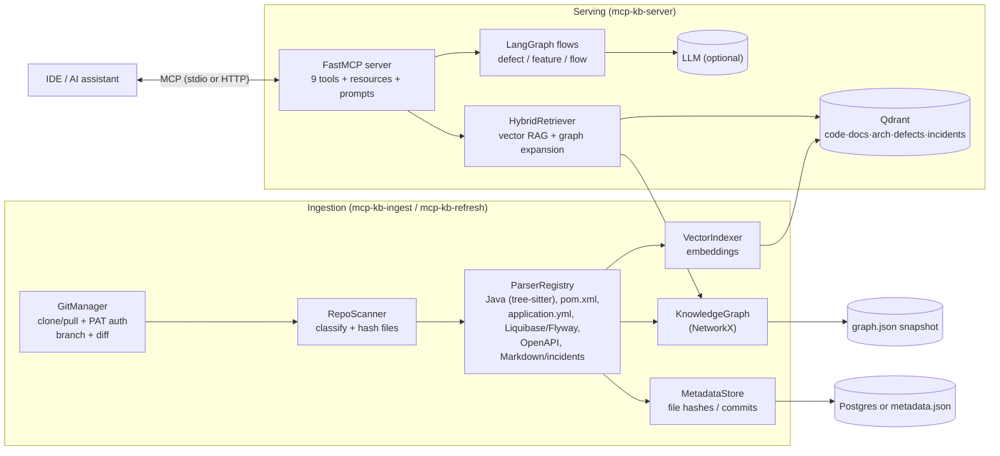

# MCP Microservices Knowledge Base — End‑to‑End User Guide

This guide explains **what the tool is, how it works internally, how to install and
run it**, and **how to integrate it with VS Code (GitHub Copilot), IntelliJ, Claude
Desktop, and other MCP clients**. It finishes with usage examples and troubleshooting.

> TL;DR: You point it at your Git repositories (with a PAT), it clones the chosen
> branches, scans and understands the Java/Spring Boot code, builds a **knowledge
> graph + vector index**, and exposes that knowledge to your AI assistant through
> the **Model Context Protocol (MCP)** as nine tools.

---

## Table of contents

1. [What it is](#1-what-it-is)
2. [How it works (architecture)](#2-how-it-works-architecture)
3. [The nine tools](#3-the-nine-tools)
4. [Prerequisites](#4-prerequisites)
5. [Install & configure](#5-install--configure)
6. [Build the knowledge base](#6-build-the-knowledge-base)
7. [Run the MCP server](#7-run-the-mcp-server)
8. [Integrate with your IDE / AI assistant](#8-integrate-with-your-ide--ai-assistant)
   - [VS Code + GitHub Copilot](#81-vs-code--github-copilot-agent-mode)
   - [VS Code + Claude (Cline / Continue)](#82-vs-code--claude-cline--continue)
   - [Claude Desktop](#83-claude-desktop)
   - [IntelliJ / JetBrains](#84-intellij--jetbrains)
   - [Any HTTP MCP client](#85-any-http-mcp-client)
9. [Using it day to day](#9-using-it-day-to-day)
10. [Keeping the KB fresh](#10-keeping-the-kb-fresh)
11. [Troubleshooting](#11-troubleshooting)
12. [FAQ](#12-faq)

---

## 1. What it is

A **local MCP server** that becomes the centralized knowledge engine for a large
Spring Boot microservice ecosystem (built for ~19 services, 100k+ LOC, thousands of
APIs). It answers questions about:

- Source code & domain knowledge
- Service relationships & dependencies
- API (REST endpoint) discovery
- Event (Kafka) discovery
- Database schema understanding
- Defect & impact analysis
- Feature‑implementation planning
- Developer onboarding

Everything runs on your machine. The only mandatory external service is **Qdrant**
(a vector database, run via Docker). PostgreSQL and an LLM are **optional**.

---

## 2. How it works (architecture)

There are two phases: **ingestion** (build the KB) and **serving** (answer queries).



### 2.1 Ingestion pipeline (feeding knowledge)

1. **GitManager** clones (or pulls) each repository listed in `config/repos.yaml`
   on the branch you specify, authenticating with your **username + PAT**. On a
   refresh it computes a per‑file diff (added / modified / deleted).
2. **RepoScanner** walks the working tree and classifies every file by content type
   (Java, Maven, Spring YAML, Liquibase/Flyway, OpenAPI, docs, incidents) and hashes
   it (SHA‑256) for change detection.
3. **ParserRegistry** dispatches each file to a specialized parser:
   - **JavaParser** (tree‑sitter) extracts controllers, endpoints (HTTP method +
     path from `@GetMapping` etc.), entities (`@Entity` + `@Table`), repositories
     (`JpaRepository<Entity, Id>`), DTOs, Feign clients (service→service calls),
     Kafka `@KafkaListener` consumers and `kafkaTemplate.send("topic")` producers.
   - **PomParser** → service identity + inter‑service dependencies.
   - **SpringYamlParser** → config, datasource, Kafka topics.
   - **Liquibase/Flyway** → database tables + columns.
   - **OpenApiParser** → endpoints & schemas from published contracts.
   - **MarkdownParser** → docs/architecture chunks; incident reports become graph nodes.
4. Each parser emits **graph nodes + edges** (structure) and **text chunks**
   (semantics). Chunks are embedded and written to **Qdrant**; nodes/edges are merged
   into the **knowledge graph** and persisted as a JSON snapshot.
5. **MetadataStore** records file hashes and the last indexed commit so refreshes only
   re‑parse and re‑embed what actually changed.

### 2.2 Serving pipeline (answering questions)

When a tool is called, the **HybridRetriever** runs **RAG + Knowledge‑Graph fusion**:

1. Embed the query and search the relevant per‑type Qdrant collections.
2. Merge results with **Reciprocal Rank Fusion**.
3. **Expand the graph** one hop from the matched symbols to add structural context
   (which controller exposes an endpoint, which table an entity maps to, etc.).
4. For complex tools (`analyze_defect`, `implement_feature`, `trace_business_flow`),
   a small **LangGraph** state machine (`retrieve → reason → synthesize`) assembles the
   answer. If an LLM is configured it writes a narrative; otherwise you get an
   accurate, citation‑backed extractive answer.

Every tool returns a uniform envelope: **structured JSON (`data`) + Markdown**.

---

## 3. The nine tools

| Tool | What it does |
|------|--------------|
| `explain_service(service_name)` | Endpoints, entities, tables, events, dependencies for a service |
| `find_endpoint(api_name)` | Locate REST endpoints by name / path / keyword |
| `trace_business_flow(flow_name)` | End‑to‑end flow across services, endpoints, events |
| `impact_analysis(entity_or_table)` | Blast radius of changing an entity/table/service |
| `analyze_defect(problem_statement)` | Root‑cause: suspect services, code paths, remediation |
| `implement_feature(requirement)` | Implementation plan: services, APIs, DTOs, tables, events |
| `search_domain_knowledge(query)` | Semantic + graph search over code/docs/incidents |
| `generate_architecture_summary()` | Whole‑ecosystem summary + Mermaid dependency graph |
| `onboarding_assistant(topic)` | Guided learning path + reading list |

It also exposes MCP **resources** (`kb://architecture/summary`, `kb://services`,
`kb://service/{name}`) and **prompts** (`investigate_defect`, `plan_feature`).

---

## 4. Prerequisites

- **Python 3.12** (3.11 works too)
- **Docker Desktop** (for Qdrant; optionally Postgres)
- **Git** on `PATH`
- A **Personal Access Token (PAT)** with read access to your repositories
- ~4 GB free RAM

---

## 5. Install & configure

```powershell
# from the project root
cd mcp-microservices-kb

# 1. Start Qdrant (and optional Postgres)
docker compose up -d qdrant postgres

# 2. Create a virtual environment and install
python -m venv .venv
.\.venv\Scripts\Activate.ps1
pip install -r requirements.txt
pip install -e .

# 3. Create your .env
copy .env.example .env
```

Behind a corporate SSL proxy? Use
`pip install --cert C:/path/corporate-ca.pem -r requirements.txt`
(or `--trusted-host pypi.org --trusted-host files.pythonhosted.org`).

### 5.1 Configure Git access (username + PAT + branch)

Edit `.env`:

```ini
# Where repos are cloned
MCP_KB_REPOS_ROOT=./data/repos
MCP_KB_REPOS_MANIFEST=./config/repos.yaml

# Private HTTPS auth (GitHub/GitLab/Bitbucket PAT)
GIT_USERNAME=your-username
GIT_TOKEN=ghp_your_personal_access_token
GIT_DEFAULT_BRANCH=main
```

Edit `config/repos.yaml` with your repositories. URLs stay **token‑free** — the PAT
is injected automatically. Set a per‑repo `branch:` to override the default:

```yaml
defaults:
  branch: main
  remote_prefix: "https://git.company.com/rx"
repositories:
  - name: rx-order-service
    url: "${remote_prefix}/rx-order-service.git"
    branch: develop            # optional override
  - name: rx-payment-service
    url: "${remote_prefix}/rx-payment-service.git"
```

SSH remotes (`git@host:org/repo.git`) also work and use your local SSH key instead of the PAT.

### 5.2 Optional: embeddings & LLM

```ini
# Local, offline embeddings (default — no API key needed)
EMBEDDING_PROVIDER=fastembed
EMBEDDING_MODEL=BAAI/bge-small-en-v1.5

# Optional: enable narrative LLM synthesis for defect/feature tools
LLM_PROVIDER=openai
LLM_MODEL=gpt-4o
OPENAI_API_KEY=sk-...
```

Without an LLM the tools still work and return accurate, citation‑backed answers.

---

## 6. Build the knowledge base

```powershell
# Clone/pull every repo in the manifest on its configured branch, using the PAT
mcp-kb-ingest --clone

# Full scan -> build vector index + knowledge graph + metadata
mcp-kb-ingest

# (or a single repo)
mcp-kb-ingest --repo rx-order-service
```

You'll see a summary table of files, chunks, graph nodes and edges per repo. Artifacts
land under `data/` (`data/repos/`, `data/graph/graph.json`, `data/metadata.json`).

---

## 7. Run the MCP server

The server speaks MCP over **stdio** (default; used by IDE clients that launch it) or
**HTTP** (for remote/shared use).

```powershell
# stdio (default)
mcp-kb-server

# HTTP on http://127.0.0.1:8000/mcp
$env:MCP_KB_TRANSPORT="http"; mcp-kb-server
```

Verify the server exposes everything:

```powershell
$env:PYTHONPATH="src"; python scripts/smoke_test.py
# -> lists 9 tools, 2 prompts, resources; prints OK
```

> **Important:** find the absolute path to the launcher — MCP clients need it.
> After `pip install -e .`, the executable is at
> `...\mcp-microservices-kb\.venv\Scripts\mcp-kb-server.exe` (Windows) or
> `.../.venv/bin/mcp-kb-server` (macOS/Linux). You can also launch it as
> `.venv\Scripts\python.exe -m mcp_kb.server`.

---

## 8. Integrate with your IDE / AI assistant

MCP is a standard protocol, so the same server plugs into many clients. Below are the
concrete configs. Ready‑to‑copy files live in the [`examples/`](../examples) folder.

Two connection styles:
- **stdio** — the client launches `mcp-kb-server` as a child process (best for local).
- **HTTP** — you run the server yourself and the client connects to a URL (best when
  shared across a team or run in Docker).

### 8.1 VS Code + GitHub Copilot (Agent mode)

Requirements: VS Code with GitHub Copilot, and **Agent mode** enabled in Copilot Chat.

Create `.vscode/mcp.json` in your workspace (or use the ready file
[`examples/vscode-mcp.json`](../examples/vscode-mcp.json)):

```jsonc
{
  "servers": {
    "microservices-kb": {
      "type": "stdio",
      "command": "C:/path/to/mcp-microservices-kb/.venv/Scripts/mcp-kb-server.exe",
      "env": {
        "MCP_KB_REPOS_ROOT": "C:/path/to/mcp-microservices-kb/data/repos",
        "QDRANT_URL": "http://localhost:6333",
        "EMBEDDING_PROVIDER": "fastembed",
        "POSTGRES_ENABLED": "false"
      }
    }
  }
}
```

Then:
1. Open Copilot Chat → switch the mode selector to **Agent**.
2. Click the **tools** (🛠️) icon → confirm `microservices-kb` and its tools are listed.
3. Ask: *"Using the microservices-kb tools, explain rx-order-service."*

Prefer HTTP? Start the server with `MCP_KB_TRANSPORT=http` and use:

```jsonc
{
  "servers": {
    "microservices-kb": { "type": "http", "url": "http://127.0.0.1:8000/mcp" }
  }
}
```

You can also add servers globally via **Command Palette → “MCP: Add Server”**.

### 8.2 VS Code + Claude (Cline / Continue)

If you use an MCP‑capable VS Code extension such as **Cline** or **Continue** (which
can run Claude models):

- **Cline:** open Cline settings → **MCP Servers** → *Edit configuration* and paste the
  same `mcpServers` block shown for Claude Desktop below (Cline uses that schema).
- **Continue:** edit `~/.continue/config.json` and add an `mcpServers` entry — see
  [`examples/continue-config.json`](../examples/continue-config.json).

### 8.3 Claude Desktop

Edit Claude Desktop's config file:

- **Windows:** `%APPDATA%\Claude\claude_desktop_config.json`
- **macOS:** `~/Library/Application Support/Claude/claude_desktop_config.json`

Add (ready file: [`examples/claude_desktop_config.json`](../examples/claude_desktop_config.json)):

```json
{
  "mcpServers": {
    "microservices-kb": {
      "command": "C:/path/to/mcp-microservices-kb/.venv/Scripts/mcp-kb-server.exe",
      "env": {
        "MCP_KB_REPOS_ROOT": "C:/path/to/mcp-microservices-kb/data/repos",
        "QDRANT_URL": "http://localhost:6333",
        "EMBEDDING_PROVIDER": "fastembed",
        "POSTGRES_ENABLED": "false"
      }
    }
  }
}
```

Restart Claude Desktop. The tools appear behind the 🔌/tools icon in the composer.

### 8.4 IntelliJ / JetBrains

Two common paths:

**A) GitHub Copilot plugin (Agent mode)** — JetBrains Copilot supports MCP. Open
**Settings → Languages & Frameworks → GitHub Copilot → Model Context Protocol** (or the
“Edit MCP configuration” action in the Copilot Chat tool window) and paste the same
`servers` block used for VS Code. Config file (if edited directly) typically lives at
`~/.config/github-copilot/intellij/mcp.json`. Example:
[`examples/intellij-mcp.json`](../examples/intellij-mcp.json).

**B) Continue plugin (works with Claude, GPT, etc.)** — install *Continue* from the
JetBrains Marketplace, then edit `~/.continue/config.json` and add the `mcpServers`
entry from [`examples/continue-config.json`](../examples/continue-config.json).

After configuring, open the assistant's tool list and confirm `microservices-kb`
appears, then ask a question that references the tools.

### 8.5 Any HTTP MCP client

Run the server over HTTP once and point any MCP‑over‑HTTP client at it:

```powershell
$env:MCP_KB_TRANSPORT="http"; mcp-kb-server   # http://127.0.0.1:8000/mcp
```

This is also how you'd expose it to a whole team from one machine or container
(`docker compose up -d` runs Qdrant + Postgres + the HTTP server on port 8000).

---

## 9. Using it day to day

Ask your assistant natural‑language questions; in **Agent mode** it will pick the right
tool automatically. Examples:

- **Understand a service:** *"Explain rx-order-service — endpoints, tables, dependencies."*
  → `explain_service`
- **Find an API:** *"Where is the endpoint that creates an order?"* → `find_endpoint`
- **Trace a flow:** *"Trace the order‑fulfilment flow end to end."* → `trace_business_flow`
- **Impact:** *"If I add a column to the orders table, what breaks?"* → `impact_analysis`
- **Defect:** *"Orders stuck in PENDING after deploy; payments succeed. Root cause?"* →
  `analyze_defect`
- **Feature:** *"Plan adding partial refunds to orders."* → `implement_feature`
- **Search:** *"How does eligibility checking work across services?"* →
  `search_domain_knowledge`
- **Architecture:** *"Give me a system architecture summary with a dependency diagram."*
  → `generate_architecture_summary`
- **Onboarding:** *"I'm new and will work on payments — where do I start?"* →
  `onboarding_assistant`

More examples: [SAMPLE_PROMPTS.md](SAMPLE_PROMPTS.md).

Each response includes `data` (structured JSON you can chain) and `markdown` (nice to
read). `generate_architecture_summary` returns a Mermaid graph you can paste anywhere.

---

## 10. Keeping the KB fresh

```powershell
mcp-kb-refresh
```

This pulls each repo and **incrementally re‑indexes only changed files** (deletes stale
vectors/graph nodes, re‑embeds modified ones). Schedule it with Windows Task Scheduler
or cron for continuous freshness. Re‑run after you (or teammates) merge new commits.

---

## 11. Troubleshooting

| Symptom | Fix |
|---------|-----|
| Client shows no tools | Confirm the `command` path is correct and executable; check the client's MCP logs |
| `graph_snapshot_missing` on start | Run `mcp-kb-ingest` before serving |
| Qdrant connection refused | `docker compose up -d qdrant`; verify `QDRANT_URL` |
| Git clone 401/403 | Check `GIT_USERNAME`/`GIT_TOKEN`; ensure the PAT has repo read scope |
| Postgres errors | Set `POSTGRES_ENABLED=false` to use the JSON fallback |
| stdio client sees corrupted output | Logs go to **stderr** by design; don't redirect them to stdout |
| Slow first request | Embedding model is warming up; later calls are fast |
| `pip` SSL `CERTIFICATE_VERIFY_FAILED` | Corporate proxy — use `--cert <ca.pem>` or `--trusted-host pypi.org --trusted-host files.pythonhosted.org` |
| Empty tool results | Re‑check `MCP_KB_REPOS_ROOT` and that ingestion completed |

Validate the server independently anytime with `python scripts/smoke_test.py`.

---

## 12. FAQ

**Do I need an OpenAI/Anthropic key?** No. Embeddings run locally; the LLM is optional.
Your MCP client (Copilot/Claude) provides the reasoning model — this server provides the
grounded knowledge and tools.

**Does my code leave my machine?** No, unless you explicitly set an external
`EMBEDDING_PROVIDER=openai` or `LLM_PROVIDER=openai`. By default everything is local.

**Different PAT per repository?** Currently one PAT is shared across repos (typical for a
single org). Per‑repo tokens can be added to the manifest if needed.

**How big can it scale?** Designed for ~19 services / 100k+ LOC / thousands of APIs.
Per‑type Qdrant collections + payload indexes keep retrieval scoped; the graph is held in
memory for fast traversal and snapshotted to disk.

**How do I reset the KB?** Stop the server, delete the `data/` folder, and re‑run
`mcp-kb-ingest` (and `docker compose down -v` to wipe Qdrant/Postgres volumes).
